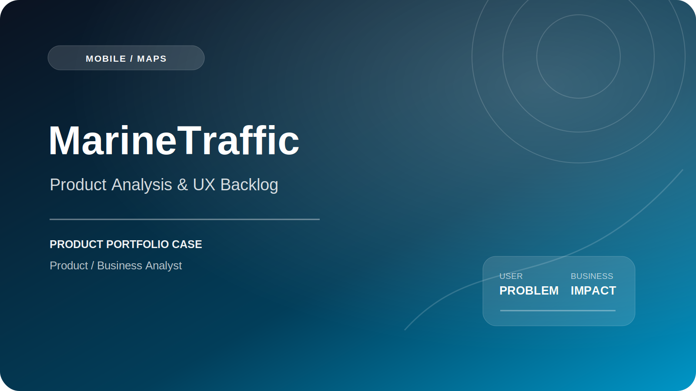

# MarineTraffic — Product Analysis & UX Backlog

   

**Анализ навигации, поиска, геоданных и доступа к расширенным функциям сервиса мониторинга судов.**

[Web](https://www.marinetraffic.com/) · [App Store](https://apps.apple.com/us/app/marinetraffic-ship-tracking/id563910324) · [Google Play](https://play.google.com/store/apps/details?id=com.marinetraffic.android)

## Контекст продукта

MarineTraffic — сервис мониторинга судов на карте. Пользователь ищет суда и порты, открывает объект, проверяет позицию и маршрут, создаёт флот и настраивает уведомления.

## Проблема пользователя и бизнеса

- плотный слой геоданных перегружает карту;
- сложно отличить похожие суда и результаты поиска;
- теряется контекст между картой и карточкой объекта;
- не всегда понятна ценность расширенной функции до ограничения;
- профессиональные и массовые сценарии конкурируют за внимание.

## Моя роль

1. Проводил разбор пользовательских сценариев и точек трения.
2. Анализировал структуру данных и информационную иерархию.
3. Проверял навигацию, поиск и переходы между картой и карточками объектов.
4. Формулировал гипотезы улучшения UX.
5. Декомпозировал решения в backlog: задача, приоритет, ожидаемый эффект, риск и метрика проверки.

## Основной пользовательский путь

`Карта → Поиск → Судно / порт → Детали → Маршрут / ETA → Follow / Alert → Повторное использование`

## Продуктовый фокус

| Область | Проблема / риск | Решение или критерий качества |
|---|---|---|
| Карта | Высокая визуальная плотность | Контекстные уровни детализации |
| Поиск | Похожие результаты | Тип, флаг, порт и идентификатор в выдаче |
| Навигация | Теряется объект после возврата | Сохранение viewport и selection state |
| Premium | Ценность функции неясна | Value preview до paywall |

## Результат и impact

Сформирован product-analysis подход: наблюдения переводятся в problem backlog, затем — в гипотезы, приоритеты, критерии проверки и метрики. Кейс не утверждает, что все предложенные изменения были реализованы.

## Metric framework

**North Star:** успешно завершённые задачи мониторинга важных пользователю судов.

**Воронка:**  
`Search / Map interaction → Object selected → Details viewed → Follow / Alert → Repeat tracking`

**Ключевые метрики:**

- search success rate;
- time to vessel / port;
- map-to-details conversion;
- follow / fleet activation;
- alert setup rate;
- repeat tracking rate;
- paywall-to-trial conversion.

**Guardrails:**

- map loading time;
- stale-data incidents;
- wrong-object open rate;
- crash-free sessions;
- notification errors.

## Артефакты Product Manager

- UX audit;
- user-flow map;
- problem backlog;
- hypothesis backlog;
- Impact / Effort prioritization;
- metric framework;
- risk register.

## Важное уточнение

Этот кейс позиционируется как **product analysis / redesign backlog**, а не как заявление о разработке всего MarineTraffic.

## Ограничения публикации

Репозиторий является портфолио-кейсом. Он не содержит production-код, внутренние документы, доступы, персональные данные, коммерческую аналитику или материалы, защищённые NDA. Официальный продукт и торговые марки принадлежат их владельцам; моя зона ответственности ограничена описанным выше scope.

## Компетенции

`Product Analysis` · `Business Analysis` · `Mobile UX` · `Maps` · `Search` · `Information Architecture` · `Prioritization` · `Product Metrics`
